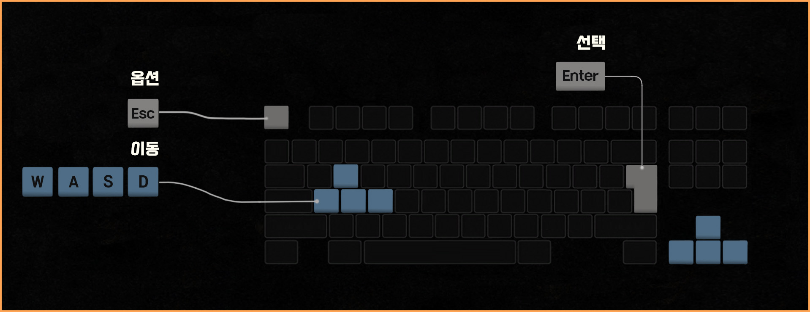

# 🕶️ Blindash (블라인대쉬)

> **"어둠 속에서 피어나는 찰나의 시야, 보이지 않는 공포를 뚫고 탈출하라."**

**Blindash**는 C++와 Windows Console API를 기반으로 제작된 **시야 제한형 미로 추격 게임**입니다.

이 프로젝트는 맵 전체를 보여주지 않고 플레이어 주변만 타원형 시야로 드러나게 설계하여, 한정된 정보 속에서 길을 찾고 위협을 피해야 하는 **탐색의 긴장감**을 극대화하는 것을 목표로 구현되었습니다.

---

## 📋 프로젝트 개요

| 항목 | 내용 |
| :--- | :--- |
| **프로젝트명** | Blindash |
| **개발 기간** | 2025.08.01 ~ 2025.08.07 (약 1주일) |
| **개발 인원** | 1인 (개인 프로젝트) |
| **개발 환경** | Windows Console (DOS) |
| **주요 언어** | C++ |

---

## 🛠️ 기술 스택 (Tech Stack)

| 구분 | 사용 기술 |
| :--- | :--- |
| **언어** | **C++** |
| **API** | **Windows Console API (WinAPI)** |
| **IDE** | Visual Studio 2022 |
| **버전 관리** | Git |

---

## 💡 핵심 구현 내용

### 1️⃣ 시야 시스템 및 타원 기반 가시성 제어
*   **시야 제한·확장**: 플레이어 주변만 타원형으로 밝혀지는 독특한 시야 시스템을 설계했습니다.
*   **가시성 확보**: 게임 진행에 따라 시야가 확장되거나 축소되는 규칙을 적용하여 긴장감과 가시성을 동시에 확보했습니다.

### 2️⃣ 데이터 주도형 레벨 및 스테이지 관리
*   **파일 파싱**: `Assets/` 내의 텍스트 파일을 파싱하여 스테이지를 생성하는 데이터 주도형 방식을 채택했습니다.
*   **확장성**: 새로운 스테이지 추가 시 코드 수정 없이 텍스트 파일 추가만으로 대응 가능한 구조를 설계했습니다.

### 3️⃣ 안정적인 엔진 아키텍처 및 이벤트 처리
*   **추상화 구조**: `Engine - Level - Actor`로 이어지는 객체지향적 아키텍처를 구축했습니다.
*   **지연 처리 시스템**: 메모리 오류 및 런타임 충돌을 방지하기 위해 이벤트 요청을 지연 처리(Deferred Processing)로 일원화하여 엔진 루프의 안정성을 높였습니다.
*   **DLL 모듈화**: 엔진과 게임 로직을 분리하여 모듈화된 아키텍처를 구현했습니다.

### 4️⃣ 사용자 경험(UX) 중심의 입력 시스템
*   **통합 입력 처리**: 단일 입력과 연속 입력을 통합하여, 정밀한 한 칸 이동과 시원한 연속 이동을 모두 지원하는 최적의 조작감을 구현했습니다.
*   **리워드형 이벤트**: 점수 획득과 시야 확장 등 아이템 획득 시 시각적/기능적 피드백이 즉각적으로 연결되는 보상 구조를 만들었습니다.

---

## 🕹️ 조작 방법 (Controls)

